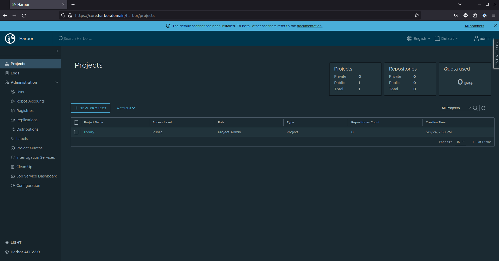

# CNCF Example

This repo is designed to build out a fully fledged k8s stack leveraging all tools from the Cloud Native Computing Foundation or part of the Linux foundation.

Current features:

* OpenTofu for IaC
* Harbor for container registry
* Prometheus / Grafana for monitoring
* Minikube for k8s
* ArgoCD for CI/CD

## Harbor

Harbor for container registry:


In order to configure the ability for harbor to work with minikube and allow for publishing images to the harbor registry, instructions are found [here](https://loft.sh/blog/harbor-kubernetes-self-hosted-container-registry/).

## Notes on Setup

For general invoking of tf within minikube, need

```bash
export KUBE_CONFIG_PATH=~/.kube/config
```

For backstage, need to run:

```bash
eval $(minikube docker-env)
yarn build-image --tag backstage:1.0.0
```